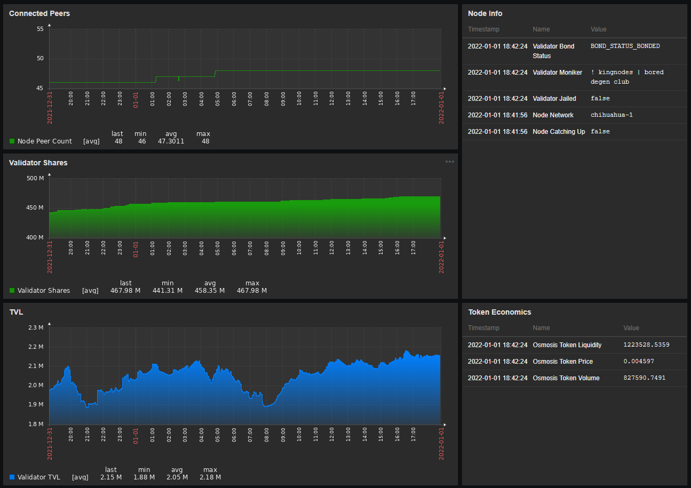

### GitHub Repo:

[GitHub - gh0stdotexe/cosmozab: Zabbix stuff for Cosmos Nodes](https://github.com/gh0stdotexe/cosmozab "GitHub - gh0stdotexe/cosmozab: Zabbix stuff for Cosmos Nodes")

### Requires:

- API and RPC exposed for localhost. Calls will be made to these services from `zabbix-agent2`. Refer to the `zab.userparameters.cosmos.conf` file for info on what calls are made to the API and RPC.

---

## Zabbix stuff for Cosmos Nodes

WARNiNG: This is still very much in development and I have not yet created most of the documentation to get up and running. Assuming you are proficient in Zabbix somewhat, you should be able to get these working. You will need to add macros etc. for some of the functionality. Just ask if there are any questions.

I have developed using Zabbix 6.0 server/gui and zabbix-agen2. But should work on any version above 5 I think.

Requires:

- API and RPC exposed for localhost. Calls will be made to these services from zabbix-agent2. Refer to the `zab.userparameters.cosmos.conf` file for info on what calls are made to the API and RPC.

## Introduction

This is a collection of instructions, configurations, and templates to integrate Zabbix monitoring with standard Cosmos Nodes running.

Configurations are based on Ubuntu 20.04, but should work on most Linux distributions.

## Screenshots



# Install Agent and Configs

Here's a script that will automate the installation and configuration of Zabbix agent on Ubuntu 20.04:

```shell
nano zabbix.sh
```

Save the script below into the `zabbix.sh` file:

```shell
#!/bin/bash

# Set server IP address
SERVER=64.227.102.155

# Install repository and update apt
wget https://repo.zabbix.com/zabbix/5.4/ubuntu/pool/main/z/zabbix-release/zabbix-release_5.4-1+ubuntu20.04_all.deb
sudo dpkg -i zabbix-release_5.4-1+ubuntu20.04_all.deb && sudo apt update
rm -rf zabbix-release_5.4-1+ubuntu20.04_all.deb

# Install zabbix-agent2
sudo apt install zabbix-agent2 -y

# Configure zabbix-agent2
sudo sed -i 's/Server=127.0.0.1/Server='"${SERVER}"'/g' /etc/zabbix/zabbix_agent2.conf

# Install config file from repo
sudo curl -o /etc/zabbix/zabbix_agent2.d/zab.userparameters.cosmos.conf https://raw.githubusercontent.com/gh0stdotexe/cosmozab/main/zabbix_agent2.d/zab.userparameters.cosmos.conf

# Update UFW for Zabbix port
sudo ufw allow from $SERVER to any port 10050

# Enable and restart zabbix-agent2
sudo systemctl enable zabbix-agent2
sudo systemctl restart zabbix-agent2
```

Save the script as a file + run it to install & configure Zabbix:

```shell
sudo bash zabbix.sh
```

This will install and configure the `Zabbix` agent, as well as update `UFW` to allow traffic on port `10050`.

Clean up the script file:

```shell
rm -rf zabbix.sh
```

---

## DEPRECATED

We will be using Zabbix version 5.4 repository.

## Install repository and zabbix-agent2

Add repository and update `apt`:

```shell
wget https://repo.zabbix.com/zabbix/5.4/ubuntu/pool/main/z/zabbix-release/zabbix-release_5.4-1+ubuntu20.04_all.deb
sudo dpkg -i zabbix-release_5.4-1+ubuntu20.04_all.deb && sudo apt update
rm -rf zabbix-release_5.4-1+ubuntu20.04_all.deb
```

Install `zabbix-agent2` with `apt`:

```shell
sudo apt install zabbix-agent2 -y
```

## Configure zabbix-agent2

Edit the `zabbix-agen2.conf`

Set a variable with your server address + inject server address into config with `sed`

```shell
SERVER=64.227.102.155
sudo sed -i 's/Server=127.0.0.1/Server='"${SERVER}"'/g' /etc/zabbix/zabbix_agent2.conf
```

## Install Configs

`curl` config file from repo

```shell
sudo curl -o /etc/zabbix/zabbix_agent2.d/zab.userparameters.cosmos.conf https://raw.githubusercontent.com/gh0stdotexe/cosmozab/main/zabbix_agent2.d/zab.userparameters.cosmos.conf
```

Update `UFW` for Zabbix port

```shell
sudo ufw allow from $SERVER to any port 10050
```

Enable and restart `zabbix-agent2`

```shell
sudo systemctl daemon-reload && sudo systemctl enable zabbix-agent2
sudo systemctl restart zabbix-agent2
journalctl -fu zabbix-agent2
```

## Clean Up Existing Monitoring (Prometheus, Node Exporter)

Disable old services:

```shell
sudo systemctl disable node_exporter
sudo systemctl disable prometheus
```

Close port 9093 (old Prometheus port):

```shell
sudo ufw status numbered

# delete both 9093 ports from list (example #'s below)

sudo ufw delete #4
sudo ufw delete #9
```

Set up&#x20;
