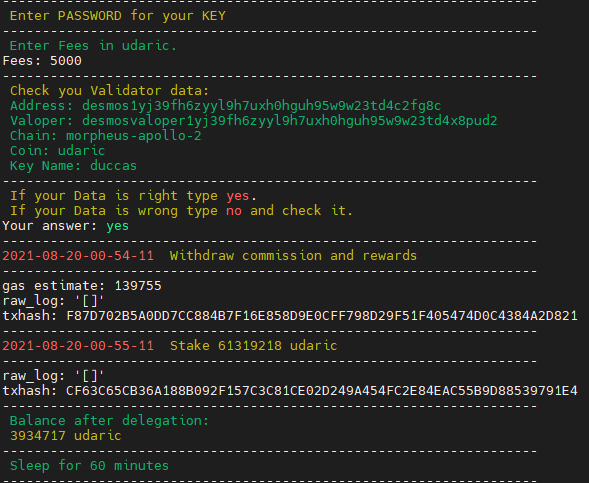
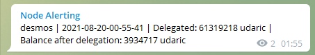

Original Guide:

[Staketab | Staketab services](https://services.staketab.com/cosmotools/auto-withdraw-delegate "Staketab | Staketab services")

---

Install script for auto-withdraw-delegate rewards to your Validator.

### Features:[​](https://services.staketab.com/tools/auto_withdraw_delegate#features "Direct link to heading")

- You can specify a custom RPC port
- Custom FEES
- Custom Sleep Time in minutes
- Send a message about delegation to Telegram
- It is enough to enter in the variables only the password, a binary, and key name in the start command
- No need to edit the config

Specify environments in this line `./start.sh -b BINARY -k KEY_NAME -s SLEEP_TIME -p RPC_PORT -t TG_TOKEN -c TG_CHANNEL`

```shell
# run script + variables
./start.sh -b desmos -k ducca -s 10m -p 36657 -t 1948967210:ATrsFGHJEpdYPO81S13nzn56FgcE_YA-t_S -c -1542578945875
-s 10m - value in seconds(s), minutes(m), hours(h)
```

### ==CAUTION==

You can use like all variables, some, or set only `-b BINARY` and `-k KEY_NAME`.

### Start a new TMUX session:[​](https://services.staketab.com/tools/auto_withdraw_delegate#start-new-tmux-session "Direct link to heading")

```shell
tmux new -s delegate
```

And start this script:

```shell
wget https://raw.githubusercontent.com/Staketab/cosmos-tools/main/auto-withdraw-delegate/start.sh \
&& chmod +x start.sh \
&& ./start.sh -b BINARY -k KEY_NAME -s SLEEP_TIME -p RPC_PORT -t TG_TOKEN -c TG_CHANNEL
```

---

### Tmux screen:[​](https://services.staketab.com/tools/auto_withdraw_delegate#tmux-screen "Direct link to heading")



### Telegram screen:[​](https://services.staketab.com/tools/auto_withdraw_delegate#telegram-screen "Direct link to heading")



<br>
