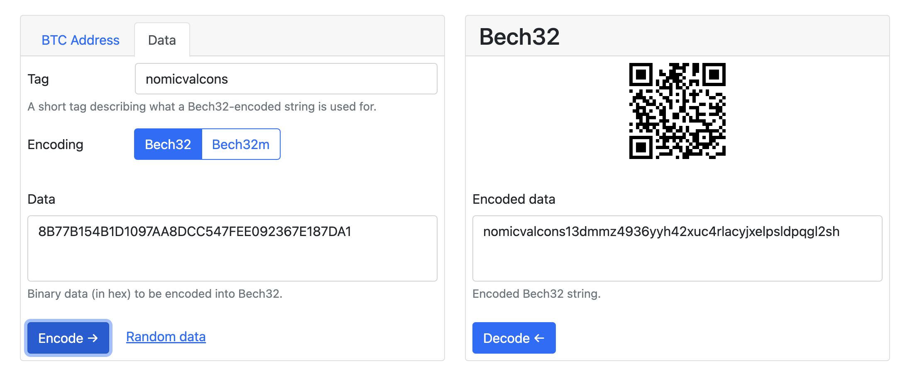

We can use a bech32 decoding utility to parse our `priv_validator_key.json` file, which will return all keys contained within.

Doing this is rather simple:

First, we'll need to open up our `priv_validator_key.json` file and find the "Pubkey Address":

```shell
# copy the "address" value below - should be 32 bytes long
  "address": "XXXXXXXXXXXXXXXXXXXXXXXXXXXXXXXXXXXXX",
  "pub_key": {
```

Next, we'll visit this website to help us decode our key:

[Bech32 Demo](https://slowli.github.io/bech32-buffer/ "Bech32 Demo")

Switch the website mode to "data" and select "bech32" as the encoding value.

In the "Data" field, enter the address from the 1st step and paste it in.

Set your "Tag" as the prefix you're looking to find (i.e., `nomicvalcons`):



Hit "encode", and it should output your encoded value.

You're done! Copy that key and use it for whatever you need 🙂
