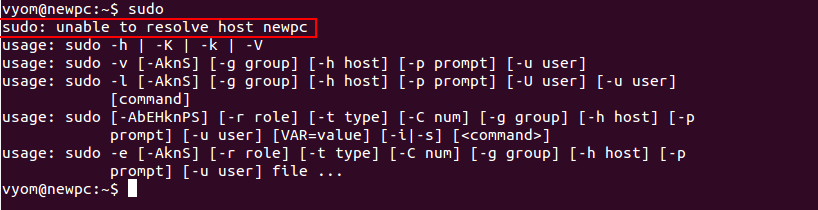
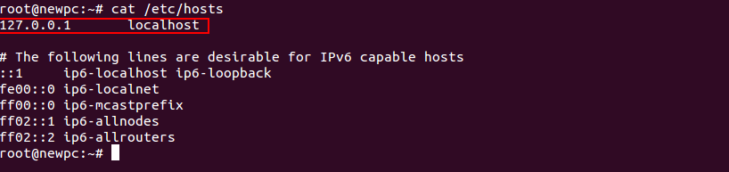
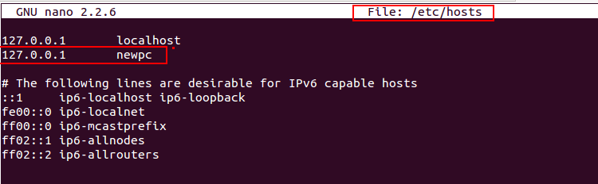
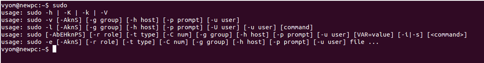

Original Documentation:

<https://www.globo.tech/learning-center/sudo-unable-to-resolve-host-explained/>

---

Sometimes, we may encounter the error `sudo: unable to resolve host`. Usually, this error occurs after changing the hostname of your system. The hostname is the name of your device that the network identifies with. The hostname is stored locally in the file “/etc/hostname”.

## Identify the Error

Before starting, we need to identify the actual error with a hostname.

First, check the hostname of [your system](https://www.globo.tech/cloud-server-pricing) by running the following command:

```shell
hostname

# should output
<current hostname>
```

The above output indicates that the [hostname ](https://en.wikipedia.org/wiki/Hostname)is already set up with your system.

Next, run the following command to reproduce the error:

```shell
sudo
```

You should see the following screen:




As you can see, the message `sudo: unable to resolve host newpc` indicates that the hostname command cannot determine the IP address of the host `newpc` .

In simple terms, the hostname command cannot resolve the hostname of your system. Since this is a local computer with no such record in the DNS.

## Update the Hostname

In order to fix the error, we will need to add the DNS record locally to your system. The local DNS record is stored in the `/etc/hosts` file.

First, log in to the `root` user with the following command:

```shell
sudo su root
```

Next, see the content of the /etc/hosts file using the following command:

```shell
cat /etc/hosts
```

You should see the following screen:




As you can see, there is no such record of your hostname `newpc`. Since the hostname is missing and your system cannot figure out the hostname and thus it throws the error ‘sudo: unable to resolve host’.

To fix this error, edit the /etc/hosts file and set the hostname `newpc` with a [loopback ](https://www.pcmag.com/encyclopedia/term/loopback-address)address (127.0.0.1).

```shell
nano /etc/hosts
```

Add the line `127.0.0.1 newpc` as shown below:



Save and close the file when you are finished. Then, test whether the error is resolved or not with the following command:

```shell
sudo
```

You should see the next screen:




As you can see the error `sudo: unable to resolve host` disappeared.

**Note** : If the old hostname is present in the /etc/hosts file then just replace them with the new hostname.
